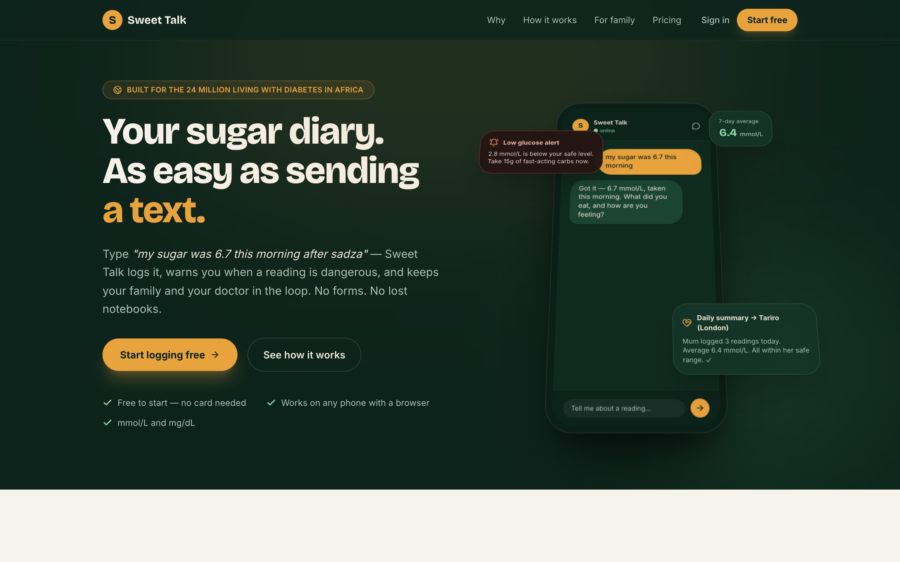
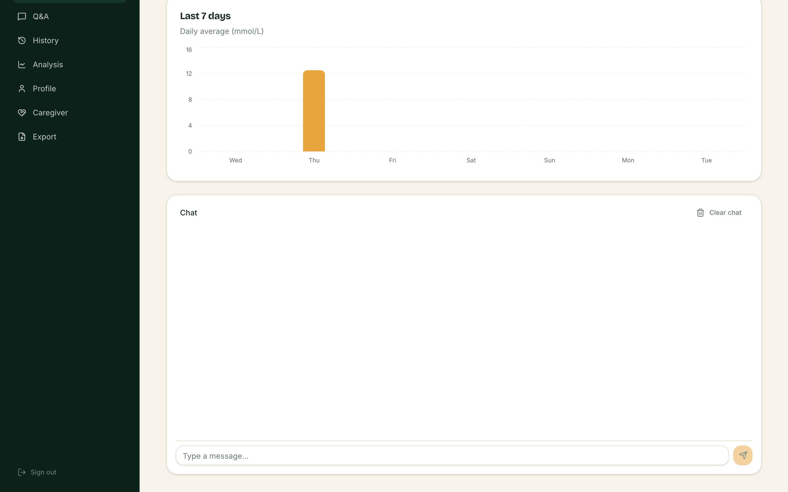
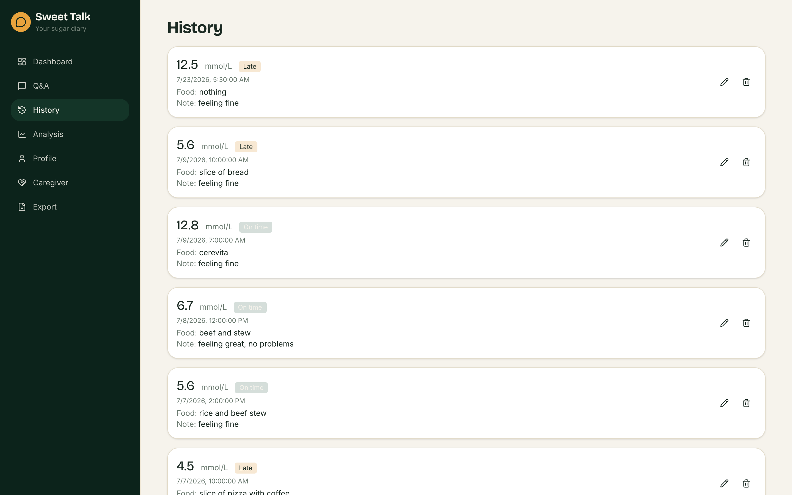
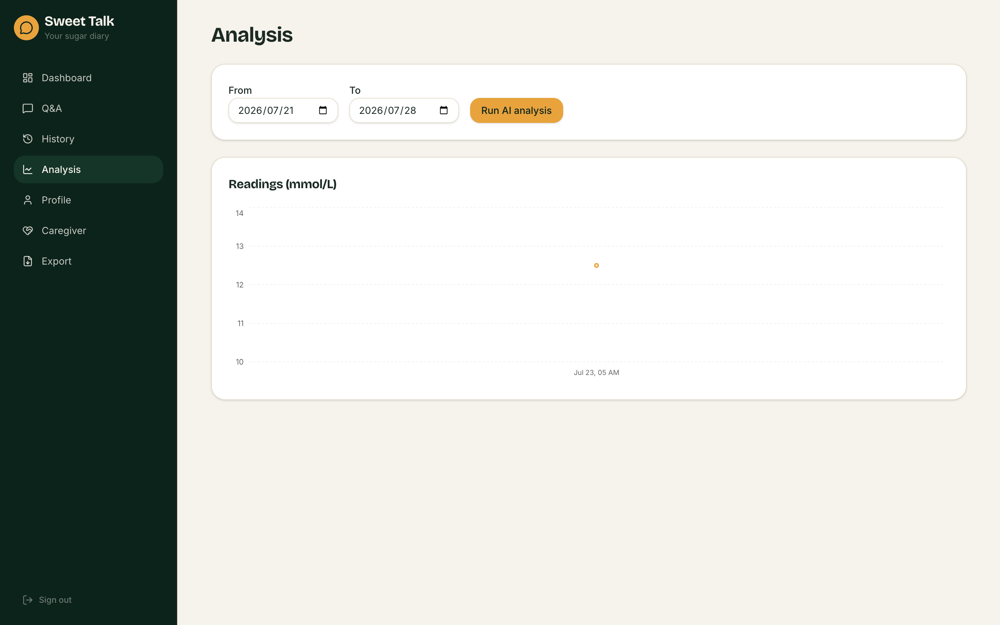
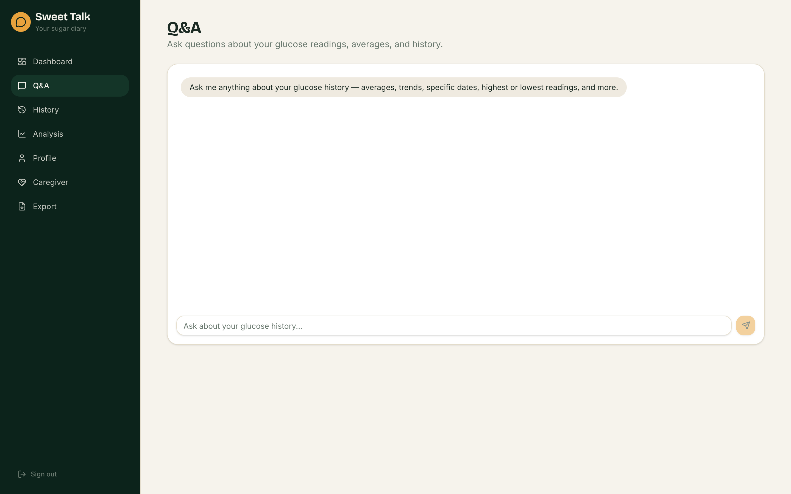
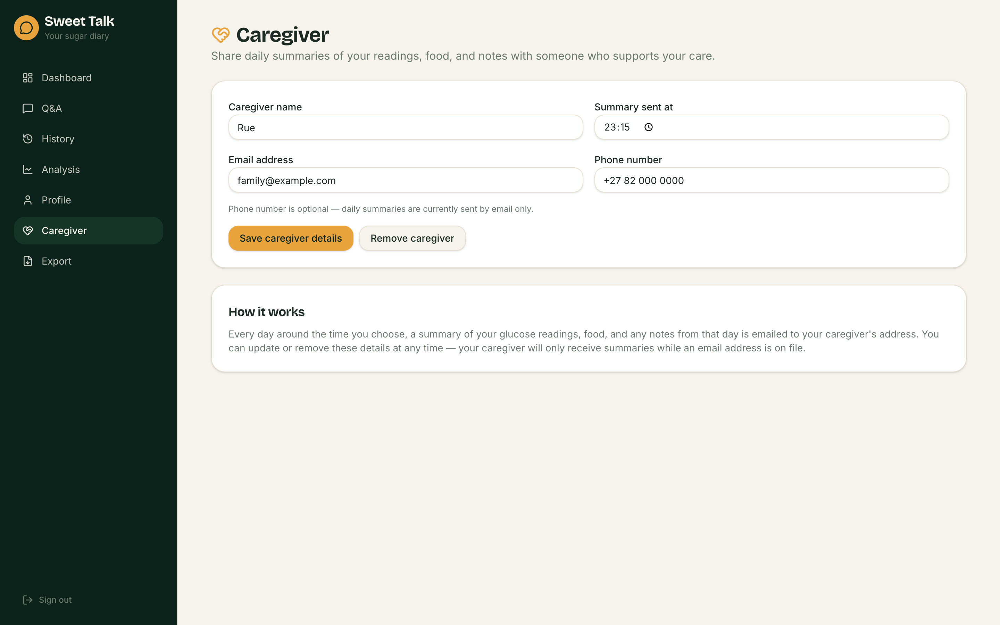
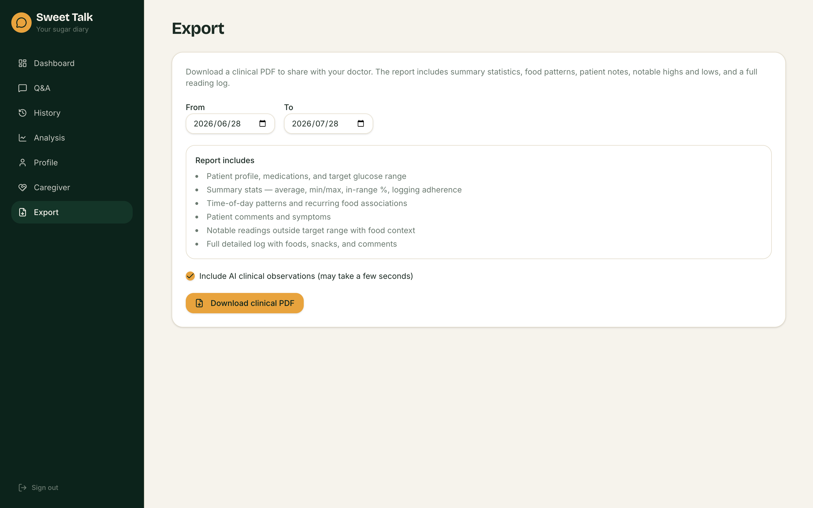

# Sweet Talk

**The sugar diary that talks like a person.**

Sweet Talk is an AI-powered glucose diary built for people living with diabetes in Africa. Log readings in a quick chat, get safety alerts when numbers are dangerous, keep family in the loop, and walk into clinic visits with a doctor-ready PDF — not a half-remembered notebook.

<p align="center">
  
</p>

---

## The problem

Paper notebooks lose readings. Expensive test strips produce numbers that never become trends. Families abroad often learn about a dangerous high or low too late. Clinic visits still rely on a few remembered values instead of months of structured data.

Sweet Talk turns everyday language — *“my sugar was 6.7 this morning after sadza”* — into confirmed records, safety guidance, caregiver updates, and clinical reports.

## Who it’s for

| Audience | Why they care |
| --- | --- |
| **People with diabetes in Africa** (Type 1, Type 2, gestational, other) | Fast, phone-browser logging in mmol/L (mg/dL supported) — no forms, no app-store friction |
| **Diaspora family / caregivers** | Daily email summaries and danger alerts for someone at home |
| **Clinicians** | Printable PDFs built from real longitudinal data, not scribbled notes |

---

## Product tour

### Dashboard — chat logging + 7-day trends

Log glucose, food, and how you feel in plain language. Confirm once, and it’s saved. A week-at-a-glance chart sits above the chat.

<p align="center">
  
</p>

### History — every reading, editable

Browse past logs with food context and notes. Edit or delete anything that was wrong.

<p align="center">
  
</p>

### Analysis — charts + AI narrative

Pick a date range, see the readings, and run an AI analysis of patterns between food and glucose.

<p align="center">
  
</p>

### Q&A — ask your own history

Ask natural questions about averages, highs/lows, and past days without digging through a spreadsheet.

<p align="center">
  
</p>

### Caregiver — keep family close

Choose who gets a daily summary of readings, food, and notes — timed for when they actually check email.

<p align="center">
  
</p>

### Export — clinic-ready PDFs

Download a clinical report with profile, meds, summary stats, notable highs/lows, and a full log — optional AI observations included.

<p align="center">
  
</p>

---

## What it does

- **Natural-language chat logging** — parse glucose, meals, snacks, symptoms, and time; confirm before save
- **Safety alerts** — immediate guidance when readings cross low/high thresholds
- **Caregiver summaries** — daily emails (and danger alerts) to a chosen family contact
- **Q&A over history** — conversational questions about averages and trends
- **Food & trend analysis** — charts plus an AI narrative of patterns
- **Doctor-ready PDF export** — clinic-style reports from real longitudinal data
- **Profile & reminders** — diabetes type, units, meds, reminder schedule, custom thresholds

---

## Tech stack

| Layer | Tech |
| --- | --- |
| **Frontend** | React 19, TanStack Start / Router / Query, Vite, Tailwind CSS, Framer Motion, Recharts, jsPDF |
| **AI agents** | [Mastra](https://mastra.ai) multi-agent service (gatekeeper → extraction → validation → QA / analysis / notifications / caregiver) |
| **Auth & DB** | Supabase (Postgres + Auth) |
| **LLMs** | Pluggable: Groq, Gemini, Anthropic, OpenAI, or Ollama locally |
| **Email** | Resend (caregiver summaries) |
| **Deploy** | Frontend → Cloudflare Workers; Agents → Render |

```
SweetTalk/
├── sweet-talk-voice-health/   # Web app (landing, auth, dashboard, export…)
├── sweet-talk-agents/         # Mastra multi-agent backend
└── DEPLOYMENT.md              # Free-tier deploy guide (Render + Cloudflare + Groq)
```

---

## Run locally

**Frontend**

```bash
cd sweet-talk-voice-health
cp .env.example .env   # fill Supabase + MASTRA_API_URL
npm install
npm run dev            # http://localhost:8080
```

**Agents**

```bash
cd sweet-talk-agents/sweet-talk-agents
cp .env.example .env   # fill LLM + Supabase keys
npm install
npm run dev            # default http://localhost:4111
```

Full free-tier production setup: see [DEPLOYMENT.md](./DEPLOYMENT.md).

---

## Why this project

Sweet Talk is a full-stack product, not a toy chat demo: multi-agent orchestration, real auth and persistence, caregiver workflows, clinical export, and a branded experience designed for users who live with diabetes every day — especially across Africa and the diaspora.
